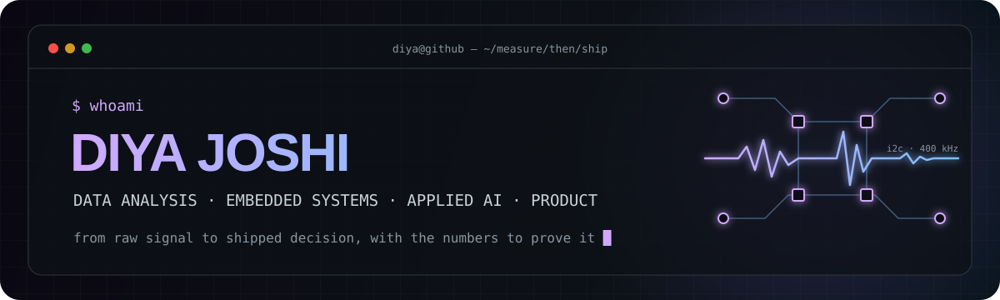
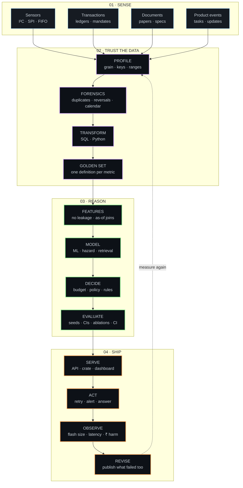

<div align="center">
  
</div>

<div align="center">
  <a href="https://diyajoshi.vercel.app/"></a>
  <a href="https://www.linkedin.com/in/diya-joshi19"></a>
  <a href="https://crates.io/crates/mpu6050-nostd"></a>
  <a href="mailto:diyajoshi1909@gmail.com"></a>
</div>

<br />

I like working at the point where a signal turns into a decision. Sometimes the signal is an I²C register on a gyroscope, sometimes it is seventeen CSVs of collections data with a headline that doesn't survive a p-value. The job is the same: **measure first, build the thing, then show the numbers that prove it works** (or the ones that prove it doesn't).

> Currently a student at **Netaji Subhas University of Technology (NSUT)**, Delhi.

```text
building_with   → Python · Rust · SQL · embedded-hal · scikit-learn · FastAPI · Next.js
thinking_about  → forensic data analysis · no_std drivers you can test on a laptop · agents that spend a budget
operating_from  → Delhi, India (UTC+5:30)
```

## `> shipped_work`

<table>
  <tr>
    <td width="50%" valign="top">
      <h3>⚡ Prahar</h3>
      <p>An agent that decides whether, when, and how to retry a failed recurring debit in India, spending a hard-capped NPCI attempt budget against a learned model of when the payer will actually have money. Built for the Razorpay AI Buildathon. The headline metric failed, and the README says so, with 95% CIs over five seeds.</p>
      <p><code>Python</code> <code>hazard models</code> <code>simulation</code> <code>ablations</code></p>
      <a href="https://github.com/diyajoshii/Prahar-RazorpayAIbuildathon"><b>source ↗</b></a>
    </td>
    <td width="50%" valign="top">
      <h3>🦀 mpu6050-nostd</h3>
      <p>A register-level <code>no_std</code> Rust driver for the MPU-6050 accelerometer/gyroscope, generic over <code>embedded-hal</code> 1.0, with a fault-injecting mock I²C bus so the whole driver, FIFO and bus failures included, runs under <code>cargo test</code> with no hardware attached. 76 tests, CI-written coverage badge, 10.6 KB of flash on a TM4C123G.</p>
      <p><code>Rust</code> <code>no_std</code> <code>embedded-hal</code> <code>I²C</code></p>
      <a href="https://github.com/diyajoshii/Rust"><b>source ↗</b></a> · <a href="https://crates.io/crates/mpu6050-nostd"><b>crates.io ↗</b></a> · <a href="https://docs.rs/mpu6050-nostd"><b>docs ↗</b></a>
    </td>
  </tr>
  <tr>
    <td width="50%" valign="top">
      <h3>🔍 CredResolve analysis</h3>
      <p>A forensic take-down of the claim "recovery improved 11% month-on-month". It hadn't: net recovery was flat, the 11% was a 31-day March next to a 28-day February, and reported figures were overstated by ₹12 Cr through duplicates and reversals. Reproducible pipeline, production-shaped SQL, golden dataset, DiD counterfactual, one-screen CEO dashboard.</p>
      <p><code>Python</code> <code>SQL</code> <code>pandas</code> <code>statistics</code></p>
      <a href="https://github.com/diyajoshii/CredResolve-analysis"><b>source ↗</b></a>
    </td>
    <td width="50%" valign="top">
      <h3>🔮 AURA</h3>
      <p>A research-paper companion for people learning machine learning. Ask a question in plain language, follow up naturally, and inspect the exact passages retrieved before the answer was written. Curated LaTeX-source library, section-aware chunks with provenance, streamed answers.</p>
      <p><code>Next.js</code> <code>Qdrant</code> <code>Gemini</code> <code>RAG</code></p>
      <a href="https://github.com/diyajoshii/AURA-AI-Research-Assistant"><b>source ↗</b></a>
    </td>
  </tr>
  <tr>
    <td width="50%" valign="top">
      <h3>📈 Prodessy</h3>
      <p>Project risk and completion forecasting for product managers: a ranked queue of at-risk tasks, predicted completion timelines, and SHAP explanations for why a task was flagged. Built for a case competition at IIM Indore.</p>
      <p><code>LightGBM</code> <code>AutoGluon</code> <code>SHAP</code> <code>NLP</code></p>
      <a href="https://github.com/diyajoshii/Prodessy-IIMIndore"><b>source ↗</b></a>
    </td>
    <td width="50%" valign="top">
      <h3>🛡️ Aegis</h3>
      <p>A campus utility platform for NSUT students: scholarship discovery, lost-and-found matching, proctored skill assessments with face detection and tab-switch tracking, and syllabus-based academic help, in one place.</p>
      <p><code>TypeScript</code> <code>Node</code> <code>face-api.js</code></p>
      <a href="https://github.com/diyajoshii/Aegis-NSUT-Campus-Utility-Platform"><b>source ↗</b></a>
    </td>
  </tr>
</table>

## `> tools_i_reach_for`

<div align="center">
  
</div>

<br />

## `> how_the_pieces_fit`



## `> contribution_arcade`

<div align="center">
  <picture>
    <source media="(prefers-color-scheme: dark)" srcset="https://raw.githubusercontent.com/diyajoshii/diyajoshii/output/github-contribution-grid-snake-dark.svg" />
    <source media="(prefers-color-scheme: light)" srcset="https://raw.githubusercontent.com/diyajoshii/diyajoshii/output/github-contribution-grid-snake.svg" />
    
  </picture>
</div>
