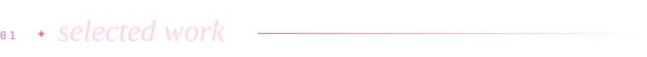
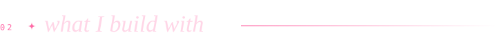
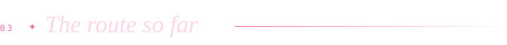
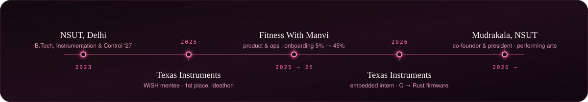
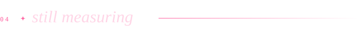

  
    
  &nbsp;
  &nbsp;
  &nbsp;
  

 

  Instrumentation &amp; Control engineer at <b>NSUT</b>, class of 2027. This summer I rewrote an Ethernet firmware module from C to Rust at <b>Texas Instruments</b>; the year before, I ran product at a fitness startup and watched onboarding climb from 5% to 45%. The common thread is a habit of measuring things properly before deciding anything.

$\color{#FF8FBA}{\textit{measure twice, ship once}}$

 

<table>
  <tr>
    <td width="50%" valign="top">
      firmware
      <h3>mpu6050-nostd</h3>
      
A register-level <code>no_std</code> driver for the MPU-6050, written from the datasheet, with a fault-injecting mock I²C bus so the entire driver, FIFO included, runs under <code>cargo test</code> on a laptop. Published to crates.io, with an on-target demo for the TM4C123G.

      
<kbd>Rust</kbd> <kbd>no_std</kbd> <kbd>embedded-hal</kbd> <kbd>I²C</kbd>

      <a href="https://github.com/diyajoshii/Rust">source</a> · <a href="https://crates.io/crates/mpu6050-nostd">crates.io</a> · <a href="https://docs.rs/mpu6050-nostd">docs</a>
    </td>
    <td width="50%" valign="top">
      decision systems
      <h3>Prahar</h3>
      
An agent that decides whether, when, and how to retry a failed recurring debit in India, under a hard cap on NPCI attempts and a model of when the payer will actually have money. Built for the Razorpay AI Buildathon. The write-up reports the metric that failed next to the ones that didn't.

      
<kbd>Python</kbd> <kbd>hazard models</kbd> <kbd>simulation</kbd> <kbd>ablations</kbd>

      <a href="https://github.com/diyajoshii/Prahar-RazorpayAIbuildathon">source</a>
    </td>
  </tr>
  <tr>
    <td width="50%" valign="top">
      data forensics
      <h3>CredResolve</h3>
      
An audit of the claim that collections recovery grew 11% month on month. It hadn't. Most of the 11% was a 31-day March sitting next to a 28-day February, and the rest was duplicates and reversals counted as cash. Reproducible pipeline, production-shaped SQL, one-screen dashboard.

      
<kbd>Python</kbd> <kbd>SQL</kbd> <kbd>pandas</kbd> <kbd>statistics</kbd>

      <a href="https://github.com/diyajoshii/CredResolve-analysis">source</a>
    </td>
    <td width="50%" valign="top">
      applied ai
      <h3>AURA</h3>
      
A chat workspace over a curated library of machine-learning papers. Ask in plain language, follow up naturally, and open the exact passages that were retrieved before the answer was written. Section-aware chunks, provenance on every citation, streamed replies.

      
<kbd>Next.js</kbd> <kbd>Qdrant</kbd> <kbd>Gemini</kbd> <kbd>RAG</kbd>

      <a href="https://github.com/diyajoshii/AURA-AI-Research-Assistant">source</a>
    </td>
  </tr>
</table>

Also on the shelf: <a href="https://github.com/diyajoshii/Aegis-NSUT-Campus-Utility-Platform">Aegis</a>, a campus platform I led product for, shipped as an MVP in 36 hours · <a href="https://github.com/diyajoshii/Prodessy-IIMIndore">Prodessy</a>, an IIM Indore case-competition prototype · and, off GitHub, a non-invasive glucose estimator from PPG signals at R² 0.989.

 

<table>
  <tr>
    <td align="right" valign="top"><b>firmware</b></td>
    <td><kbd>Rust</kbd> <kbd>C / C++</kbd> <kbd>embedded-hal</kbd> <kbd>I²C · SPI</kbd> <kbd>cargo test</kbd> <kbd>Linux</kbd></td>
  </tr>
  <tr>
    <td align="right" valign="top"><b>data</b></td>
    <td><kbd>Python</kbd> <kbd>SQL</kbd> <kbd>pandas</kbd> <kbd>NumPy</kbd> <kbd>LightGBM</kbd> <kbd>Power BI</kbd> <kbd>Tableau</kbd></td>
  </tr>
  <tr>
    <td align="right" valign="top"><b>ai</b></td>
    <td><kbd>RAG</kbd> <kbd>Qdrant</kbd> <kbd>LLM APIs</kbd> <kbd>NLP</kbd> <kbd>feature engineering</kbd></td>
  </tr>
  <tr>
    <td align="right" valign="top"><b>product</b></td>
    <td><kbd>Notion</kbd> <kbd>Miro</kbd> <kbd>Jira</kbd> <kbd>Confluence</kbd> <kbd>roadmaps</kbd> <kbd>GTM decks</kbd></td>
  </tr>
</table>

 

 

  
off the clock

   
  <ul>
    <li>Co-founded and lead <b>Mudrakala</b>, NSUT's Indian performing-arts society. Fifty partner colleges, five hundred people at the first fest.</li>
    <li>International rank 46 at the International Mathematics Olympiad, back when the signals were on paper.</li>
    <li>One of ten students from Uttarakhand picked for ISRO's Young Scientists Programme.</li>
  </ul>

 

Delhi · UTC+5:30 · <a href="mailto:diyajoshi1909@gmail.com">diyajoshi1909@gmail.com</a>

